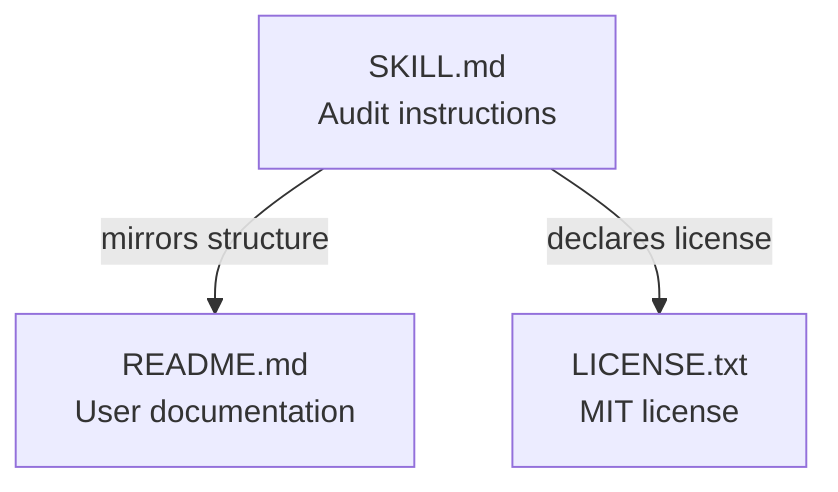
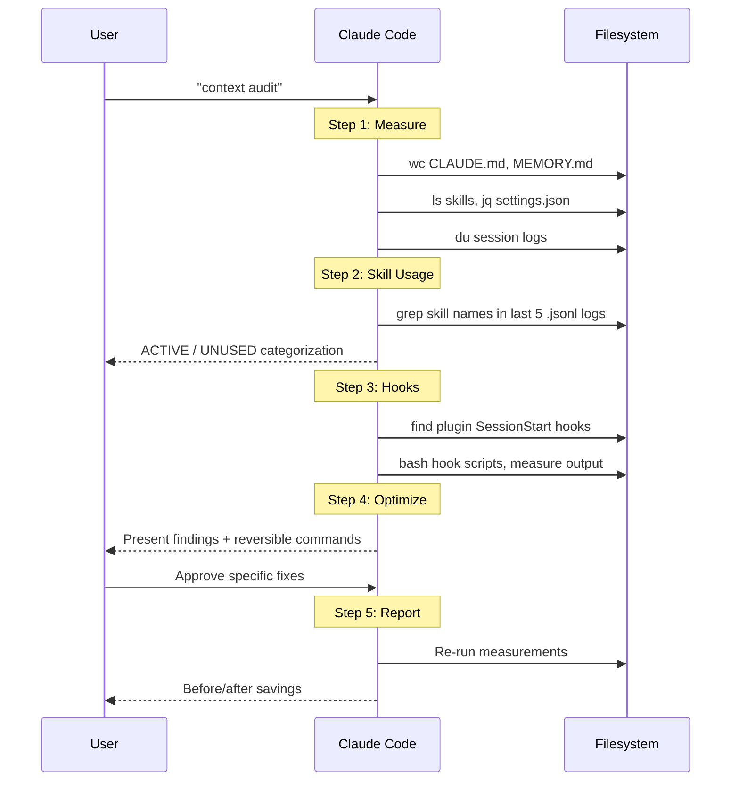

# Codebase Map — claude-context-audit

## Overview

A Claude Code agent skill that audits context window overhead and recommends optimizations. No executable code — instructional markdown with embedded bash snippets.



## Directory Tree

```
claude-context-audit/          # Root — agent skill
├── SKILL.md          (1,229t) # Audit workflow: 5 steps with bash commands
├── README.md           (695t) # Install, usage, strategies, limitations
├── LICENSE.txt         (220t) # MIT — Jeremy Knows, 2026
├── .gitignore            (4t) # .DS_Store
└── docs/
    └── CODEBASE_MAP.md        # This file
```

## Key Files

| File | Purpose | Key Content |
|------|---------|-------------|
| `SKILL.md` | Agent instructions | 5-step audit: measure, audit skills, audit hooks, optimize, report |
| `README.md` | User documentation | Install, natural language triggers, audit targets, limitations |
| `LICENSE.txt` | Legal | MIT license |

## Audit Data Flow



## Claude Code Internals Referenced

| Path | What | Why It Matters |
|------|------|----------------|
| `~/.claude/CLAUDE.md` | Global instructions | Loaded every session |
| `~/.claude/projects/*/memory/MEMORY.md` | Per-project memory | First 200 lines auto-loaded (twice due to known bug) |
| `~/.claude/skills/*/` | Skill registry | Each adds ~200 chars to system prompt |
| `~/.claude/settings.json` | Plugins + hooks config | `enabledPlugins`, `hooks` sections |
| `~/.claude/plugins/cache/*/*/*/hooks/` | Plugin hook scripts | SessionStart hooks re-fire on every compaction |
| `~/.claude/projects/*/*.jsonl` | Session logs | Disk usage, skill usage audit source |

## Bash Dependencies

`wc`, `du`, `ls`, `grep`, `jq`, `printf`, `sort`, `head`, `bash`, `mv`, `rm`

Only `jq` is non-standard — skill falls back gracefully if missing.

## Conventions

- **Safety first**: All optimizations are reversible (archive, not delete)
- **User approval required**: Findings presented before any changes applied
- **Shell safety**: `2>/dev/null` on all globs (zsh compatibility), no `eval`, safe tilde expansion via `${cmd/#\~/$HOME}`
- **Bash arithmetic**: `count=$((count + 1))` instead of `((count++))` (avoids exit 1 with `set -e`)

## Navigation Guide

| To do this... | Touch these files |
|---------------|-------------------|
| Add a new audit check | `SKILL.md` — add a new bash block in the appropriate step |
| Update install instructions | `README.md` — Install section |
| Change the optimization strategies | `SKILL.md` Step 4, `README.md` Optimization strategies section |
| Add a new trigger phrase | `SKILL.md` frontmatter `triggers` array |
| Update version number | `SKILL.md` frontmatter `metadata.version` |
| Verify cross-file consistency | Compare `SKILL.md` Step 4 against `README.md` optimization strategies |
